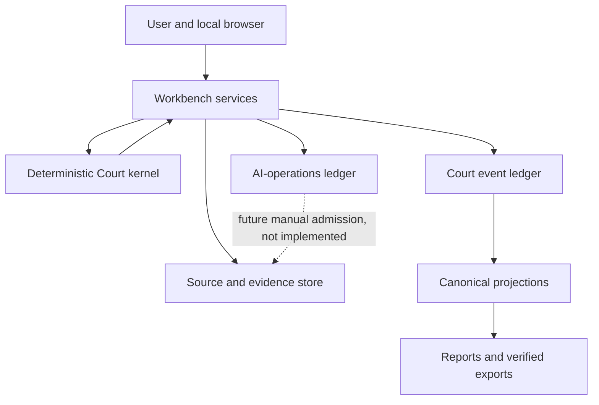
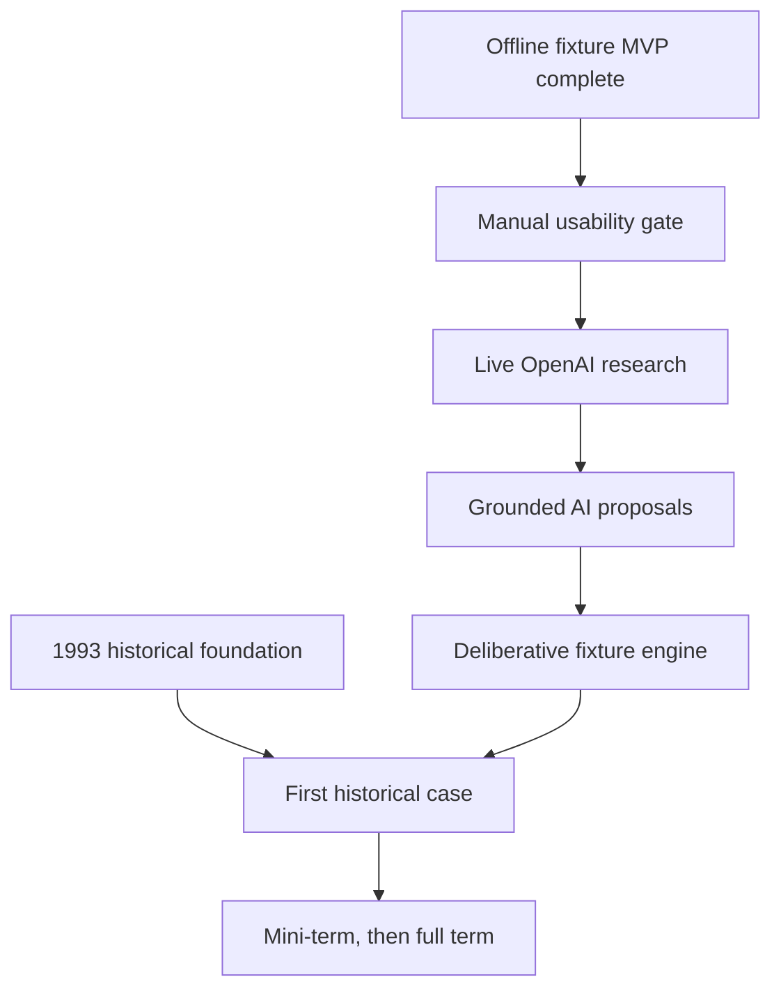

# SCOTUS Simulator: Comprehensive Project Handoff and Roadmap

**Handoff date:** September 6, 2026  
**Last reported branch:** `master`  
**Last reported clean HEAD:** `b742bb3409f75c89fc1b8e416039fa9957f7033c`  
**Repository:** `C:\Users\alexl\Projects\scotus-simulator`  
**Current stage:** Offline fixture MVP substantially complete; live AI phase not yet implemented

## 1. How to use this handoff

Attach this file to the new ChatGPT or Codex conversation. It is designed to preserve the project's goal, history, architecture, binding constraints, present capabilities, limitations, and forward plan without reconstructing the earlier chats.

The implementation facts and test results in this document come from the commit reports supplied during development. They have not been independently audited from this conversation. The repository, `README.md`, `package.json`, migrations, tests, and especially `docs/DECISIONS.md` remain authoritative. The new agent must verify the current repository before changing anything.

Recommended first message in the new conversation:

> Read the attached project handoff completely. Then inspect the currently opened SCOTUS Simulator repository without changing it. Verify the working directory, clean Git status, exact HEAD, architecture, package scripts, current tests, and the source, Court-ledger, and AI-operations boundaries. Report any conflict between the handoff and the repository. Do not install anything, read credentials, make network requests, or edit files until the preflight is complete.

## 2. Executive position

The project is no longer a prompt collection or a set of planning templates. It is a functioning local TypeScript application with:

- A deterministic Court kernel
- Immutable proposal history
- Durable SQLite event ledgers
- Exact version and approval gates
- Atomic fixture decisions
- Legal-state continuity
- Deterministic reports and immutable exports
- A local read-only viewer and interactive workbench
- Source preservation, passage approval, and frozen evidence packets
- A durable research workflow using a fake provider

The application can currently run a complete manual two-case invented fixture simulation. It can prove that Case One changes the legal state used by Case Two. It can preserve sources, freeze evidence, record private controlled-Justice reasoning, validate a proposal, collect distinct approvals, commit a decision, reconstruct legal state, and publish a verified output.

It cannot currently search the internet, call OpenAI, generate judicial reasoning, simulate the historical October Term 1993 Court, or operate Stone as a verified alternate-history Chief Justice.

The clearest status label is:

> **Offline fixture MVP complete enough to use and evaluate; live AI and historical simulation remain the next product stages.**

## 3. North-star goal

Build a local-first, API-assisted, research-grounded simulation of the Supreme Court of the United States that can run an alternate historical Court across complete October Terms while preserving legal and institutional continuity.

The intended mature simulator should:

1. Begin from a verified historical legal and institutional boundary.
2. Let the user control a selected Justice, initially the fictional Chief Justice Stone, through natural-language reasoning.
3. Model the remaining Justices independently from eligible sources, their public jurisprudence, the record, and the law existing in the simulated timeline.
4. Conduct realistic case-level deliberation, including separate initial analyses, conference, coalition formation, opinion assignment, circulation, revision, joins, concurrences, dissents, judgment, remedy, and precedential effect when a case warrants that depth.
5. Keep the real historical outcome of a pending case sealed so it does not dictate the simulated result.
6. Let doctrine evolve only from authorities inherited at the boundary and decisions actually committed in the simulation.
7. Maintain complete operative Holdings, Standards and Tests, and Standing State across cases and terms.
8. Preserve every original input, model proposal, validation result, user approval, source, commitment, and state transition required for audit and replay.
9. Use models for contextual legal analysis and generative reasoning while keeping arithmetic, identity, versioning, authority, and commitment rules deterministic.
10. Support a typical term of approximately 50 to 80 cases without turning the user experience into a tagging or bookkeeping exercise.

The model is meant to reason broadly from well-prepared context. Structured contracts protect provenance, authority, and state transitions. They must not predetermine legal conclusions or reduce judicial analysis to a fixed template.

### 3.1 Evolution from the original chat workflow

The original simulation ran inside a ChatGPT Project. The user repeatedly supplied an Engine, Turn Output instructions, Standing State, Holdings, Standards and Tests, and batches of case briefs. One chat turn represented an October Term.

The new design changes the source of authority:

| Original approach | Current or intended application approach |
| --- | --- |
| Re-upload Engine instructions | Encode institutional rules and workflow in versioned code and configuration |
| Re-upload Turn Output instructions | Generate views through a versioned renderer |
| Manually update Holdings | Project Holdings from committed Court events |
| Manually update Standards and Tests | Project standards, versions, and applications from committed effects |
| Carry Standing State between chats | Project and export Standing State from an exact verified frontier |
| Depend on chat memory | Depend on SQLite ledgers, source packets, replay, and state roots |
| Supply many case-brief batches to one conversation | Intake cases and sources through a resumable local workbench |
| One monolithic term response | Process ordered case and institutional events while preserving term-level continuity |

The user should eventually need to provide only the case materials, approved alternate-history premises, and Stone's reasoning. Internal IDs, provenance, versioning, validation, state transitions, reports, and context assembly should be managed by the application.

## 4. Product philosophy and non-negotiable boundaries

### 4.1 Separate creativity from authority

Models may research, analyze, criticize, propose, draft, and simulate. They may not silently approve, commit, or change canonical law.

Deterministic code owns mechanical questions:

- Identity and eligibility
- Participation and quorum
- Ballot completeness and vote arithmetic
- Version and approval matching
- Schema conformance
- Authority references
- Atomic persistence
- Replay, projection, and integrity

Human and model reasoning handle contextual questions:

- Meaning of precedent
- Doctrinal fit
- Competing interpretive methods
- Factual characterization
- Institutional consequences
- Remedy
- Coalition possibilities
- Opinion language
- Limits and reserved questions

Passing deterministic checks means that a proposal is internally processable. It does not mean it is legally correct, historically plausible, persuasive, or justified.

### 4.2 Preserve distinct authority levels

The system separates:

- Original source bytes
- Source metadata and eligibility judgments
- Approved passages
- Frozen evidence packets
- Research gaps and candidates
- Private controlled-Justice reasoning
- Proposed interpretations of that reasoning
- Draft decision packages
- Validation attestations
- Controlled-position approval
- Court-result approval
- Commitment confirmation
- Committed Court events
- Projected legal state
- Rendered reports
- Published exports

No layer acquires the authority of a later layer merely because it exists.

### 4.3 Preserve history rather than overwrite it

The architecture is event-sourced and append-oriented. Revisions create new records. Approvals bind exact bytes and versions. Committed decisions are terminal. Reports are generated views. Corrections or alternate timelines must eventually preserve earlier records rather than rewrite them invisibly.

### 4.4 Fail closed at material gaps

A missing source, stale approval, uncertain identity, unresolved historical rule, incompatible timeline, or uncertain provider outcome pauses the affected operation. The system must not invent a bridge merely to keep moving.

### 4.5 Keep the user in control without clerical micromanagement

The user supplies reasoning in ordinary prose. The system should infer structure, identify ambiguity, explain what it understood, propose precise wording, and ask for approval at legally meaningful boundaries. The user should not have to hand-author IDs, hashes, schemas, or internal metadata.

## 5. Current status at a glance

| Area | Current position |
| --- | --- |
| Court kernel | Implemented for supported fixture merits decisions |
| Proposal lifecycle | Implemented with immutable revision, validation, and approval history |
| Persistence | Court and source stores report verified backup coverage; AI operations report durable recovery, with exact backup coverage to verify in code |
| Canonical commitment | Implemented for standalone, already-accepted fixture merits cases |
| Legal-state continuity | Demonstrated across two invented cases |
| Reports | Deterministic case results, Holdings, Standards and Tests, and Standing State |
| Exports | Verified immutable local publication bundles |
| Read-only interface | Implemented |
| Interactive workbench | Implemented for the complete two-case fixture workflow |
| Source intake | Implemented with original-byte preservation, quarantine, passage review, and frozen packets |
| Research workflow | Implemented with a deterministic fake provider |
| Live OpenAI research | Not implemented |
| AI legal proposals | Not implemented |
| Multi-Justice deliberation | Not implemented |
| Historical 1993 baseline | Not implemented |
| Stone historical transition | Not implemented |
| Full-term scale | Not demonstrated |

## 6. Last reported repository and toolchain state

These facts must be rechecked in the new conversation.

| Item | Last reported value |
| --- | --- |
| Repository path | `C:\Users\alexl\Projects\scotus-simulator` |
| Branch | `master` |
| HEAD | `b742bb3409f75c89fc1b8e416039fa9957f7033c` |
| Git status | Clean |
| Active Node.js | 26.5.0 |
| Compatibility runtime | Node.js 24.19.0 LTS |
| npm | 11.17.0 |
| TypeScript | 7.0.2 |
| Node declarations | 24.13.3 |
| Runtime schema validator | Ajv 8.20.0 |
| SQLite | 3.53.3 through `node:sqlite` |
| Latest test count | 4,011 passing on each Node runtime |

Node 24 was reported from a Codex-managed runtime cache. That cache should not become a permanent application dependency. A normal, pinned Windows Node 24 LTS installation remains the preferred long-term foundation.

The last Step 4B verification encountered a timeout when both runtime suites ran in parallel. The Node 24 suite passed when rerun alone. Future full-suite verification should run Node 26 and Node 24 serially unless the environment is proven safe for parallel execution.

## 7. Repository organization and sources of truth

The six legacy Markdown files are:

- `legacy/CASE BRIEF.md`
- `legacy/Engine.md`
- `legacy/HOLDINGS.md`
- `legacy/STANDARDS AND TESTS.md`
- `legacy/STANDING STATE.md`
- `legacy/Turn Output.md`

They remain unchanged reference material, not the operative engine or canonical legal state.

The planning and decision documents under `docs/` include:

- `PRODUCT_AND_WORKFLOW.md`
- `COURT_KERNEL.md`
- `CANONICAL_LEGAL_STATE.md`
- `API_REASONING_PIPELINE.md`
- `OUTPUT_STUDIO.md`
- `MIGRATION_AND_EVALUATION.md`
- `DECISIONS.md`

The codebase is organized conceptually around:

- `src/contracts/`: versioned domain and transport formats
- `src/schemas/`: strict runtime schemas
- `src/codecs/`: deterministic decoding and encoding
- `src/kernel/`: pure Court rules
- `src/application/`: lifecycle and orchestration services
- `src/adapters/`: persistence, HTTP, filesystem, and provider boundaries
- `tests/`: fixtures, unit, integration, adversarial, crash, and cross-runtime coverage
- `migrations/`: Court-ledger migrations
- `source-migrations/`: source-evidence migrations
- `.local-db/`: ignored generated databases

The exact current tree must be read from the repository.

## 8. Implementation history

All counts are reported results, not an independent audit.

| Commit | Milestone | Principal result | Tests per runtime |
| --- | --- | --- | ---: |
| `e491116c38aa8138fc600125ae48883cf8991c33` | Pre-existing baseline | Planning and legacy files already tracked | Not supplied |
| `229b85f8307b3c1842faf331859d2cf14bd6d15a` | `Record architecture decisions through DEC-16` | Architecture, decision register, and `.gitignore` | Documentation checks |
| `dfeecf460e847d8626d9c94e7f69d13ce9ed59b6` | `Implement deterministic vote validator` | Participation, quorum, ballot, tally, and majority kernel | 118 |
| `ea61f7d4145176b6853cbfd603212b1473ef33d0` | `Harden validator runtime boundary and diagnostics` | Proxy rejection, detached data, stable diagnostics | 246 |
| `8d7ad41361b8da8d54d206bce470fc876f1595f6` | `Implement proposal approval and versioning gate` | Create, revise, validate, approve, replay, and intent preparation | 440 |
| `86b5e35187aed84be975fd55210adb158adf2a57` | `Add strict proposal runtime schemas` | Ajv decoding, deterministic encoding, and resource limits | 859 |
| `30bd71e1b894958ae2620de325441eb2d9acfd30` | `Implement durable proposal event ledger` | SQLite events, idempotency, integrity, backup, and restart | 975 |
| `89b6e748ba483f1d96a7531b8f28c94a03dbeb77` | `Implement canonical fixture decision commit gate` | Exact approval and atomic fixture commitment | 1,758 |
| `1bd408f9480ee2dab5e4d9d0c3c2c413283e9f43` | `Implement fixture legal-state projections` | Initialization, projections, Markdown, and two-case continuity | 2,056 |
| `f1d2397a87cb9e340cea44b4dda633532967007d` | `Publish verified local export bundles` | Immutable verified export publication | 2,346 |
| `e04def441ce90da42cafd96f43b301fcb6da06ee` | `Implement read-only local Court interface` | Local viewer for state, reports, exports, and integrity | 2,639 |
| `f6775e379eca312e52f06fd095707f4e6459b4a0` | `Implement secure fixture proposal workbench` | Private reasoning, meaning review, editing, validation, and approvals | 3,120 |
| `4cbdaa9fd680830eb8357c17c3557b9d08e4a1cd` | Browser-entry fix | Preserved workbench entry using `strict-origin` | 3,122 baseline later reported |
| `cfc78229292ef9ab8bc57020c343fd1c78b04d9f` | `Complete interactive fixture Court workflow` | Commitment, Case Two continuity, exports, and response-loss recovery | 3,429 |
| `56d454feebbb92e12c1e97853ba5f1df87091eb6` | `Implement secure source intake and evidence packets` | Source database, passage review, intake, and frozen packets | 3,738 |
| `b742bb3409f75c89fc1b8e416039fa9957f7033c` | `Implement durable fake research workflow` | Research Lab, AI-operations database, dispatch, recovery, and quarantine | 4,011 |

### 8.1 Important adversarial review history

The first validator commit passed its original tests but failed an independent review. JavaScript proxies could alter behavior after inspection, substitute ballots, throw outside a guard, or expose mutable aliases. Malformed diagnostics also depended on array order.

The next commit corrected those defects by rejecting proxies before traversal, using detached validated data, and generating stable identity-based or canonical-content diagnostics. This is a standing lesson for the project: test quantity does not replace adversarial counterexamples and invariant review.

## 9. Current architecture



The dotted transition is intentionally nonautomatic. A research candidate cannot become eligible evidence merely because a provider returned it.

### 9.1 Persistent stores and authority

| Store | Purpose | Authority |
| --- | --- | --- |
| Court event ledger | Proposals, validations, approvals, initialization, and commitments | Authoritative history of the simulated Court |
| Source evidence store | Original files, metadata, eligibility, passages, intake, and frozen packets | Authoritative audit record of preserved sources, scoped reviews, passages, and packets; not proof of truth, legal authority, or simulated law |
| AI-operations store | Research authorization, dispatch, recovery, output, review, and quarantine | Operational record only; no Court authority |
| Export filesystem | Published reports and state bundles | Presentation of one verified frontier; never a source of law |

### 9.2 Court kernel

The kernel accepts explicit rule snapshots, rosters, participation facts, judgment components, ballots, and claimed results. It recomputes rather than trusts supplied tallies.

It distinguishes unknown or ineligible participants, recusal, out-of-service status, missing and duplicate ballots, lack of quorum, tie, plurality, judgment majority, separate dispositions and remedies, and claimed versus calculated coalitions.

A judgment majority does not imply a controlling rationale, opinion join, precedent, or legal correctness.

### 9.3 Proposal lifecycle and approvals

The application supports proposal creation, immutable revision, validation, approval, replay, read-only intent preparation, and later commitment through the decision gate.

Approvals bind exact proposal bytes, hashes, revisions, and validation evidence. An edit makes affected validation or approval stale. Controlled-position approval and Court-result approval are separate. Commitment requires another explicit confirmation. A committed proposal is terminal.

### 9.4 Court event ledger

The Court ledger uses SQLite with strict tables, checksummed migrations, immutable-record triggers, foreign keys, expected versions, atomic batches, and idempotency identifiers.

Reported controls include WAL, full synchronization, defensive mode, trusted-schema restrictions, bounded cells, checkpoint settings, BigInt reads, parameter restrictions, and a 5,000 ms timeout.

It supports restart and replay, exact retry receipts, rollback on failed writes, integrity verification, online verified backup, and recovery from a verified backup.

Its hash chain detects corruption within its threat model. It cannot defeat an owner with full filesystem control who rewrites all history and recomputes hashes. It also cannot independently detect complete suffix removal without a separately retained checkpoint.

### 9.5 Canonical commitment and projections

The fixture decision gate validates judgment votes, rationale joins, holdings, remedies, references, sources, and declared effects. A successful commitment atomically appends the terminal proposal event and Court-decision event. Failed or stale commitment appends neither.

The projector rebuilds state from verified events and renders case results, Holdings, Standards and Tests, and Standing State.

The demonstrated continuity is:

1. Case One creates invented holding H1 and standard S1.
2. Case Two loads the accepted state produced by Case One.
3. Case Two explicitly applies H1 and S1.
4. Case Two creates H2.
5. S1 remains at version 1 with its original hash while its later application is recorded.

This proves mechanical continuity, not historical or substantive legal correctness.

The current effect vocabulary demonstrates additive creation and unchanged later application. It does not yet prove modification, limitation, distinction, supersession, or overruling.

### 9.6 Exports

The publisher writes exact renderer bytes to staging, synchronizes and verifies them, performs one rename, and verifies the destination again. Exact retries do not rewrite an existing correct destination. Corrupt destinations remain untouched.

Exports are nonauthoritative views of an exact frontier. They cannot change the Court ledger or legal state.

Before concurrent independent publisher processes are allowed, output-root ownership must be initialized. A process encountering an unfinished initial ownership marker fails closed. Portable filesystem protections cannot defeat every hostile junction substitution or sudden power loss.

### 9.7 Browser interfaces

The read-only viewer includes overview, timeline, cases, case details, holdings, standards, standing state, reports, exports, and integrity.

The private workbench includes reasoning revisions, meaning review, proposal editing, validation, separate approvals, commitment review, explicit commitment, Case Two unlocking, export review, source materials, evidence packets, Research Lab, history, and integrity.

Reported protections include loopback-only HTTP, strict Host and Origin checks, one-time launch entry, per-launch sessions, action-bound CSRF forms, strict UTF-8 decoding, POST-Redirect-GET, stale-tab rejection, escaped HTML, bounded resources, restrictive headers, and graceful shutdown.

The workbench uses `Referrer-Policy: strict-origin` because `no-referrer` broke launch entry. The read-only viewer retains `no-referrer`. Do not reverse that distinction without reproducing and replacing the entry mechanism.

There is no reported browser JavaScript or external asset dependency. These controls protect a local session. They are not identity authentication and do not protect against malicious software or another person controlling the Windows account.

### 9.8 Source and evidence system

Source materials live in a separate SQLite system with a separate integrity root. Reported limits are 4 MiB per document, 20 documents per operation, and 16 MiB per operation.

The source workflow preserves original bytes, quarantine status, metadata revisions, scoped eligibility decisions, exact approved passages, case intake, frozen evidence packets, immutable history, and verified backups.

Known events are:

- `source.imported`
- `source.metadata-revised`
- `source.eligibility-reviewed`
- `case-intake.created`
- `case-intake.revised`
- `evidence-packet.approved`

A future model may receive only an exact approved packet bound to its authorization. Sealed, quarantined, stale, unrelated, and ineligible materials remain unavailable.

Eligibility is a human-reviewed conclusion. Import or classification does not prove authenticity, legal authority, historical availability, or sufficiency. Source storage is currently local plaintext.

Source and AI-operation data are reported as unencrypted at the application level. This handoff makes no claim that the Court database or the underlying Windows volume is encrypted.

### 9.9 Research Lab

Research Lab uses a third SQLite boundary for AI-operation state. Step 4B reportedly added 23 schemas, 14 event types, durable authorization and dispatch, crash recovery, candidate review, and quarantine preservation.

The current provider is deterministic and fake. It proves exact authorization, durable dispatch, concurrency protection, retry reconciliation, recovery, candidate preservation, quarantine, and separation from Court authority.

Successful and concurrent fake execution reportedly invoked the provider once. Exact retries and recovery invoked it zero additional times.

The Step 4B report states that research changed no Court state, existing frozen packets, reports, or exports. Repository tests must be inspected before asserting a stronger invariant for every proposal and approval stream.

The fake provider proves nothing about live latency, retention, billing, rate limits, unpredictable responses, citation quality, or legal research quality.

### 9.10 Version and compatibility cautions

Reported formats include vote validation V1; ledger envelope, inert JSON, and append V1; baseline package V1; projection contracts V1; projector 1.0.0; Markdown renderer V1; export contracts V1; and source-evidence contracts V1.

Proposal and decision formats evolved additively. Reports mention merits-decision packages V1 through V3, proposal-event payloads V1 through V4, terminal proposal V2, committed proposal and decision events V1 through V3, and workbench/form/public UI formats through V2.

These are different layers. A payload version, event-envelope version, schema version, provider profile, projector version, and database migration number are not interchangeable. Step 4B reports 23 schemas and 14 research event types but does not reproduce their identifiers. Copy exact current names from the code, never reconstruct them from this handoff.

## 10. Currently supported workflows

The commit reports establish three adjacent workflows. They do not establish that source packets or Research Lab presently feed or gate fixture commitment. Repository inspection must confirm any existing integration before a new chat describes one unified end-to-end path.

### 10.1 Two-case Court workflow

1. Start the workbench and initialize the invented baseline.
2. Supply or edit the controlled fixture Justice's reasoning.
3. Approve the system's concise interpretation of that reasoning.
4. Edit the complete Case One proposal.
5. Run deterministic consistency checks.
6. Approve the controlled fixture Justice's public position.
7. Approve the complete Court result separately.
8. Review the exact commitment intent.
9. Confirm commitment explicitly.
10. Atomically commit Case One and verify ledger and projected state.
11. Unlock Case Two only through verified Case One authority.
12. Repeat review and commitment for Case Two.
13. Confirm that Case Two applies H1 and S1 and creates H2 without rewriting S1.
14. Review an exact export frontier.
15. Publish an immutable verified export bundle.

### 10.2 Source and evidence workflow

1. Import local case materials.
2. Preserve exact original bytes in quarantine.
3. Review and revise metadata.
4. Make a scoped human eligibility decision.
5. Approve exact passages.
6. Create or revise case intake.
7. Explicitly freeze an evidence packet.
8. Preserve earlier packets unchanged when intake or evidence later changes.

### 10.3 Fake Research Lab workflow

1. Define a bounded research need.
2. Review the disclosure and authorization.
3. Persist authorization before dispatch.
4. Invoke the deterministic fake provider.
5. Reconcile concurrency, retry, interruption, and recovery without duplicate invocation.
6. Review returned claims and source candidates.
7. Preserve selected candidates in quarantine.

The connection from a quarantined research candidate to preserved and eligible source material is a future workflow. Current manual source acquisition may be informed by a candidate, but no candidate is promoted automatically. Current fixture commitment may not require a frozen evidence packet unless repository inspection proves otherwise.

Commands last reported as available:

```powershell
Set-Location "C:\Users\alexl\Projects\scotus-simulator"
npm run ui:workbench
```

Read-only completed fixture demonstration:

```powershell
npm run ui:demo
```

Read an existing fixture database:

```powershell
npm run ui -- --db ".local-db\fixture-demo.sqlite"
```

The new agent must inspect `README.md` and `package.json` before assuming these commands remain unchanged.

## 11. Scenario and policy decisions

`docs/DECISIONS.md` is authoritative. This section records what can be reconstructed from the supplied conversation. A recommendation is not a selection. When an exact option is missing, the new agent must read the register rather than infer it.

| Decision | Status supported by the handoff record | Substance |
| --- | --- | --- |
| DEC-01 | Explicitly selected | Option A, offline merits pilot with two invented, already-accepted cases and manual proposals. API, research, UI, broader procedure, and full opinions were initially deferred. Later commits added UI and research scaffolding without turning on paid AI. |
| DEC-02 | Explicitly selected | Option A, two meaningful reviews. First approve the interpretation of Stone's reasoning, then approve exact attributed wording and the final package. No standing permission to narrow or change substance. Stone's position and the Court result require separate approvals. |
| DEC-03 | Selection not visible | Corrections versus alternate timelines. Nothing is erased; objective error repair must be distinguished from a preferred alternative; affected later cases require review. Branching was deferred and is not implemented. Read the register for the selected policy, if any. |
| DEC-04 | Confirmed by later statements | Fresh simulation at the opening of October Term 1993. October 4, 1993 was provisional. The exact final historical event and first simulated event remain unresolved. |
| DEC-05 | Later summaries suggest Option A; verify in register | The apparent operative policy is necessary factual departures only, preserving unrelated history and the fixed pre-boundary Supreme Court record. The visible conversation does not show the selection itself. |
| DEC-06 | Explicitly confirmed as R1 | Stone is a separate fictional alternate-history person replacing William H. Rehnquist as Chief Justice, with no earlier Supreme Court service. He is not Harlan Fiske Stone or an alias. Biography, qualifications, departure cause, appointment sequence, dates, and enabling events remain unresolved. |
| DEC-07 | Presented as pending | Inherited-law policy. The recommended option was surviving historical law through the boundary, but the visible record does not show selection. The fixed pre-boundary Supreme Court record remains a constraint. |
| DEC-08 | Presented as pending | Unsupported old-register rules. They cannot silently become historical law, and material gaps block affected cases. The visible record does not show an option selection. |
| DEC-09 | Presented as pending | Stone is the initially intended controlled Justice. Fixed control, future switching, or multiple controlled Justices remains unresolved in the visible record. |
| DEC-10 | Reported as recorded | Petition-stage control is separate from merits control. The exact selected option must be read from the register. |
| DEC-11 | Reported as recorded | A verified opening-state inventory is mandatory and cannot be replaced by a selected-case list. Exact calendar breadth and date policy must be read from the register. |
| DEC-12 | Reported as recorded | Opening procedure must reflect legally effective rules at the boundary unless a separately approved alternate change applies. Confirm the exact selection in the register. |
| DEC-13 | Recorded with explicit clarification | Independence must be affirmative. File order cannot make one nominally independent same-day case influence another. |
| DEC-14 | Explicitly summarized | Supplied-materials-only during the offline pilot. Targeted research awaits reconsideration and separate enablement. Connected-event suggestions remain disabled. |
| DEC-15 | Reported as recorded | Post-divergence historical Supreme Court results remain quarantined before commitment. Confirm any screened-comparison policy in the register. |
| DEC-16 | Reported as recorded | Later reproductions may verify earlier facts only under the selected verification rule, with later additions and outcome-revealing material excluded. Confirm the exact option in the register. |
| DEC-17 | Explicitly pending | Historical-result reveal timing and any deliberately exposed experimental mode. Optional features remain off. |
| DEC-18 | Explicitly pending | Adaptive, user-selected, or uniformly major model reasoning depth. No model reasoning currently operates. |
| DEC-19 | Explicitly pending | Paid-model spending and retry limits. The operative external-service budget remains $0. |
| DEC-20 | Explicitly pending | Public continuity only versus later private modeled-Justice memory. |
| DEC-21 | Explicitly pending | Default case-report presentation style. Existing renderer capability does not select a policy option. |
| DEC-22 | Explicitly pending | When full-length opinions should be generated. |
| DEC-23 | Explicitly pending | PDF or Word formats beyond current Markdown-oriented exports. |
| DEC-24 | Explicitly pending | Long-term source retention, local privacy, and optional application-level encryption. Current source storage is plaintext. |
| DEC-25 | Explicitly pending | Additional devices, synchronization, and collaborators. Current operation is local and single-computer. |

The conversation reports that DEC-10 through DEC-16 and 52 clarifications were recorded. Most selected option letters were not reproduced in the reports. The actual register controls.

Later implementation commits add capabilities. They do not silently resolve pending policy decisions.

## 12. Current unsupported scope

### 12.1 Live intelligence

- OpenAI API connection
- Live internet or provider-assisted legal research
- API-key handling
- Paid calls
- Live latency, pricing, rate-limit, and provider-failure behavior
- Provider-generated citations
- Model-generated legal proposals

### 12.2 Historical operation

- Verified October Term 1993 event boundary
- Verified Stone biography and qualifications
- Lawful Rehnquist departure and Stone appointment sequence
- Verified historical roster, seats, and seniority
- Period-specific procedural rule package
- Source-backed inherited-law coverage for the first real case
- Complete opening inventory and docket chronology
- Production identity verification
- Historical case admission
- Real spoiler-seal demonstration

### 12.3 Complex Court behavior

- Fractured controlling-rationale analysis
- Partial opinion joins
- Tie disposition workflow
- Complex alternative holdings
- Certiorari petitions
- Emergency and temporary-relief applications
- Rehearing and amended opinions
- Canonical corrections
- Alternate timeline branches
- Modeled conference and circulation
- Full-length opinion workflow

### 12.4 Product scale and deployment

- Demonstrated performance for 50 to 80 cases
- Multi-user identity and permissions
- Multi-device synchronization
- Collaboration and merge rules
- Cloud deployment
- Application-level encryption
- Complete browser and assistive-technology evaluation

## 13. Proposed major-case AI reasoning pipeline

The AI phase should not be one enormous prompt that decides an entire term. Maximum useful capability can come from staged, source-bound reasoning with independent perspectives and deterministic gates. The exact depth, private-memory policy, and opinion length remain subject to DEC-18, DEC-20, and DEC-22. The sequence below is a proposed major-case pipeline, not a selected universal requirement.

1. **Case intake:** Preserve the brief, record, questions, procedural posture, and private controlled-Justice reasoning separately.
2. **Evidence preparation:** Classify sources, approve passages, resolve material date and authority gaps, and freeze a packet.
3. **Targeted research:** Search only for explicit gaps. Preserve the exact request and response. Treat every result as an unverified candidate.
4. **Evidence admission:** Review authenticity, relevance, date eligibility, authority, and spoiler risk. Import selected material through Case materials and freeze a new packet.
5. **Independent Justice analyses:** Give each modeled Justice the same eligible public materials and simulated law, but not Stone's private position or other Justices' first-pass conclusions.
6. **Controlled-Justice meaning review:** Convert Stone's natural-language reasoning into a concise proposed position for user approval or correction.
7. **Conference synthesis:** Compare independent positions, identify agreements and disagreements, test coalitions, and preserve uncertainty.
8. **Opinion assignment and drafting:** Apply date-eligible assignment rules. Draft judgment, remedy, controlling reasoning, and separate writings.
9. **Circulation:** Let modeled Justices respond to exact drafts, change joins for recorded reasons, and request revisions.
10. **Independent legal audit:** Challenge unsupported facts, missing authorities, timeline leakage, vote-to-reason mismatches, and remedial gaps.
11. **Structured decision package:** Encode votes, joins, holdings, standards, applications, remedies, sources, limits, and reserved questions.
12. **Deterministic validation:** Recompute all mechanical, version, and authority relationships.
13. **Separate approvals:** Approve Stone's attributed position and the complete Court result independently.
14. **Commitment:** Bind the exact approved bytes and atomically commit.
15. **Projection and export:** Rebuild legal state, generate reports, and publish an exact frontier.
16. **Historical comparison:** Compare with real history only when the selected reveal policy permits it, without rewriting simulated history.

### 13.1 Using capable models without rigidifying the Court

- Use structure at boundaries, not as a substitute for analysis.
- Let the model perform full analytic work before encoding conclusions.
- Supply the exact eligible record, law, Justice profile, and procedural setting.
- Separate initial Justice calls to reduce anchoring.
- Use a second-pass critic with a distinct task and context framing.
- Allocate deeper processing to uncertain law, mixed remedies, institutional consequences, or likely fractures.
- Use cheaper calls for extraction, normalization, and clerical tasks.
- Version every model, prompt, reasoning setting, context manifest, and evaluation.
- Score source fidelity, doctrinal continuity, Justice consistency, counterarguments, and remedy coherence independently.
- Preserve uncertainty rather than forcing false unanimity or a single canonical test.

Schemas should ensure traceability and safe commitment. They should not force all legal reasoning into tags.

## 14. Overall roadmap

Product engineering and historical preparation can proceed as separate tracks. They converge before the first real historical case.



Historical preparation should run in parallel with the AI-assisted fixture work. The tracks converge only after both the fixture AI workflow and the source-backed historical foundation pass their own gates.

### Phase 4B-usability: Manual operator walkthrough

**Purpose:** Confirm that the current application is usable by its intended operator, not merely correct in automated tests.

The user should complete Case One and Case Two through the browser, exercise restart and verified backup, use source intake and a frozen packet, run fake research, commit both cases, and publish an export. Record every point where developer knowledge is required.

The source, fake-research, and Court workflows may still be adjacent rather than fully integrated. The walkthrough should establish the actual connections instead of assuming them.

**Completion gate:**

- The user can complete both fixture cases using the workbench and README.
- Case Two demonstrably uses H1 and S1 from Case One.
- Restart, backup, stale-state, and export behavior are understood.
- Usability defects are separated from authority, integrity, and legal-quality defects.

Estimated effort: half a day to one day, plus repairs found.

### Phase 4C: Secure live OpenAI research provider

**Purpose:** Add an optional real provider while retaining the current research authorization, recovery, quarantine, and authority boundaries.

**Required work:**

- Keep the fake provider as the default.
- Add a versioned OpenAI Responses API web-search provider profile.
- Read the API key only at the live server boundary.
- Keep live operation disabled unless explicitly enabled.
- Present the exact disclosure and require separate authorization and execution.
- Disable automatic SDK and application retries.
- Persist a client request ID before dispatch and capture the server request ID.
- Bound request size, response size, timeout, source count, output tokens, and provider attempts.
- Use `store: false` while accurately explaining that it does not independently promise zero retention.
- Preserve inline citations and the full consulted-source list separately.
- Leave all returned claims and sources quarantined.
- Add versioned pricing, conservative per-job reservation, aggregate ceiling, and no automatic top-up.
- Make zero live calls during implementation and automated tests.
- Add a disabled, separately confirmed live-smoke command.

**Completion gate:**

- Existing fake workflows still pass.
- Automated provider tests cannot contact the internet.
- Credentials appear nowhere in databases, WAL files, backups, logs, HTML, errors, exports, Git, or tests.
- Completed, refused, failed, rate-limited, timed-out, and interrupted requests reach correct durable states with no hidden retry.
- Live research retains zero Court or evidence authority.
- One separately authorized harmless smoke query can later run using invented material.

### Phase 4C-live: One paid smoke test

This happens only after the connector is committed and reviewed.

Before any live request, DEC-14 must be reconsidered to authorize targeted live research, and DEC-19 must establish a nonzero budget and retry policy. A disabled adapter does not resolve either decision.

**User setup:**

- Create or select an OpenAI API project.
- Configure API billing, which is separate from the ChatGPT subscription.
- Set a deliberately small project hard limit and alert.
- Create a project-scoped API key.
- Put the key in one temporary PowerShell process without saving or sharing it.
- Select an explicit nonzero application budget for the job.

**Smoke scope:**

- One invented, nonhistorical research question
- One request
- Small disclosed input
- Reviewed legal or governmental domains
- Low output limit
- No retry
- Quarantined results only
- Immediate proof that Court state and frozen evidence packets did not change

### Phase 4D: Complete the research-to-evidence loop

**Purpose:** Move useful provider candidates into a newly approved packet without automatic promotion.

For the first version, manual acquisition and import of the underlying source is safer than automatic remote downloading. Automatic retrieval introduces redirects, server-side request-forgery risk, dynamic documents, access restrictions, and content-type problems.

**Completion gate:**

- A live candidate can lead to a newly approved evidence packet.
- No candidate becomes evidence solely because a model cited it.
- Every approved passage has preserved bytes, provenance, scope, approval, and a stable hash.
- Earlier frozen packets remain unchanged.

### Phase 4E: Source-grounded AI proposal generation

**Purpose:** Generate an editable decision proposal from one exact evidence packet and one exact legal-state frontier without granting model authority.

Before the first model-assisted case, resolve DEC-18 so the reasoning-depth policy is explicit.

**Required work:**

- Add a versioned model-operation contract and provider profile.
- Add a case-context compiler that produces an exact manifest of included and intentionally omitted materials, detects token-budget truncation, and fails when a material dependency is excluded.
- Bind the model, reasoning level, instructions, packet root, Court frontier, legal-state root, and output schema to authorization.
- Use structured output for the proposal envelope while preserving expressive legal analysis.
- Prohibit web access during adjudicative generation unless research occurred as a separate approved operation.
- Require source references for material factual and legal claims.
- Preserve the raw provider response privately and decoded proposal separately.
- Reject malformed, unsupported, stale, cross-case, sealed, or authority-incompatible output.
- Insert accepted output only as a draft revision.
- Require the existing meaning review, validation, approvals, and commitment confirmation.

**Completion gate:**

- One invented case receives a complete AI-generated proposal from an exact packet.
- Material claims are traceable or explicitly unresolved.
- The user can revise or reject the proposal.
- No output can self-approve, self-commit, alter evidence, or mutate legal state.
- Replay identifies the exact model, instructions, evidence, state, and response used.

Replay reproduces accepted state from preserved model output. It does not promise that a fresh call will reproduce the same analysis, even with the same model name and inputs.

### Phase 4F: Complete AI-assisted fixture demonstration

The target browser walkthrough is:

1. Import an invented case brief.
2. Freeze a packet.
3. Authorize one live research job.
4. Review quarantined candidates.
5. Admit selected source material through Case materials.
6. Freeze a replacement packet.
7. Generate an AI decision proposal.
8. Review the controlled fixture Justice's meaning and exact wording.
9. Validate, separately approve, and explicitly commit.
10. Generate reports and publish an export.
11. Restart and confirm identical history and state.

**Completion gate:**

- The intended user can complete the flow without developer intervention.
- Lost responses, stale tabs, expired authorization, refusal, and budget exhaustion fail safely.
- Private reasoning and credentials remain absent from public and canonical surfaces.
- Both supported Node runtimes reproduce the state.
- A normal pinned Node 24 LTS installation replaces reliance on the Codex-managed cache before the application is called distributable.

### Phase 5A: Formal model-evaluation harness

**Purpose:** Establish evidence-based quality thresholds before expanding model autonomy or evaluating famous historical cases.

Build a small held-out fixture corpus and a human review rubric covering:

- Claim-to-source support
- Citation and quotation accuracy
- Temporal authority eligibility
- Issue coverage
- Justice-profile consistency
- Judgment, join, and remedy consistency
- Uncertainty calibration
- Spoiler exposure

Set acceptance thresholds before viewing benchmark results. Do not use the same model's self-critique as the only evaluator.

### Phase 5B: Deliberative fixture engine

**Purpose:** Replace a single generated package with a deliberative fixture simulation using explicitly invented Justice profiles. This phase does not establish historical Justice fidelity.

Required additions include:

- Versioned public jurisprudential profiles for participating Justices
- Separate first-pass analysis for each modeled Justice
- Controlled conference disclosure
- Coalition and opinion-assignment logic using date-eligible rules
- Draft circulation and revision
- Explicit opinion joins and judgment votes
- Concurrences and dissents
- Partial joins and fractured reasoning
- An explicitly invented, versioned controlling-rationale policy for the fixture
- Remedy and mandate analysis
- Independent criticism and evaluation

**Completion gate:**

- A major invented case produces distinct source-grounded positions from isolated first-pass contexts.
- Conference and circulation can change coalitions for recorded reasons.
- Judgment, opinion joins, and precedential effect remain separate.
- The system preserves a real fracture or uncertainty rather than fabricating one controlling rule.

Separate calls reduce shared-context anchoring. They do not create genuinely independent minds or prove that the outputs represent distinct human Justices.

### Phase 6: October Term 1993 historical foundation

This is a research and policy project as much as a coding phase. It should begin in parallel with Phases 4C through 4F, but no historical commitment may occur until both tracks are ready.

Before sensitive rather than public historical material is imported, resolve DEC-24. Before permanent historical commitment, resolve DEC-03 and implement any minimum objective-correction path required by the selected policy.

Required foundation includes:

- Exact final included historical event and first simulated event
- Complete opening inventory of pending and carried matters
- Verified historical roster, seats, seniority, recusal, and participation
- Stone's approved identity, biography, qualifications, prior offices, jurisprudence, nomination, confirmation, commission, oath, and assumption of office
- Rehnquist's departure premise and dates
- Compatibility of preparatory factual events with the fixed legal boundary
- Period-specific quorum, voting, assignment, tie, and divided-opinion rules
- Source-backed inherited law for the first cases and every material dependency
- Eligible Justice writings and public profiles
- Docket chronology and lower-court records
- Outcome sealing and post-divergence authority rules
- Resolution or confirmation of decisions that block historical operation

The baseline should be dependency-driven. It need not encode all American law before the first case, but it must resolve every material dependency of that case.

**Completion gate:**

- A production timeline is structurally isolated from fixture identities and law.
- Stone is never inserted into pre-divergence historical votes or opinions.
- The opening snapshot is reproducible from approved sources.
- Unresolved facts are visible and block affected work.
- The first historical case passes chronology, roster, procedure, and inherited-law preflight.
- Post-divergence real Supreme Court results remain quarantined.

### Phase 6A: Historical-source preparation

Before the first historical case, establish:

- A source hierarchy and authority-status vocabulary at the cutoff
- Subsequent-treatment and good-law review as of the cutoff, not the present day
- Original-document and modern-reproduction handling under DEC-16
- PDF and OCR extraction as derived, nonauthoritative text
- Page and passage mapping back to preserved source bytes
- Copyright, access, and quotation restrictions
- Larger-document handling, because the current 4 MiB source limit may reject scanned records and historical authorities
- Material-dependency and source-gap review for the selected case

Every participant-facing passage should trace to preserved source material and an eligibility decision. OCR text must not silently replace the underlying page image.

### Phase 6B: Historical Justice modeling

Resolve DEC-17 and DEC-20 before historical modeled reasoning. Read DEC-09 for the controlled-Justice policy and DEC-12 for the applicable procedural-rule selection.

Build versioned public jurisprudential profiles from date-eligible writings and joins. Do not infer private motives, reduce Justices to ideological scores, or insert Stone into pre-divergence cases.

Each modeled Justice should receive the same eligible public case record and simulated law, subject to role-specific jurisprudential context. First-pass calls should be isolated to reduce anchoring, while acknowledging that multiple calls to one model are not independent human minds.

The historical case-context compiler must record every included and intentionally omitted source, the operative legal-state frontier, token counts, truncation decisions, and unresolved dependencies. A material omission blocks generation.

### Phase 7: Extend the legal engine for needed historical case shapes

Add only the procedural and doctrinal shapes needed by the next selected cases, such as:

- Modify, limit, supersede, distinguish, reaffirm, and overrule
- Multiple issues and alternative grounds
- Partial joins and fractured rationales
- Separate judgment and rationale coalitions
- Vacatur, affirmance, reversal, remand, dismissal, mootness, DIG, and jurisdictional outcomes
- Ties and absence of a controlling rationale
- Opinion assignment and reassignment
- Amended opinions and rehearing
- Genuine corrections, subject to DEC-03
- Same-day independent groups
- Date-effective Court-rule changes
- Explicit uncertainty when period law is unsettled

Unsupported case shapes must stop rather than be approximated.

### Phase 8: First historical decision and continuity pair

Start with a bounded merits case, not the most famous or procedurally fractured case.

The first case must have complete material facts, authorities, rules, participation, Stone review, independent modeled positions, explicit votes and joins, adversarial legal review, exact approval, atomic commitment, and a sealed historical result.

Then process a second historical case that materially depends on the first. This is the real continuity proof. Case Two must load the exact state root from Case One and expressly apply, distinguish, limit, or change its simulated law.

### Phase 8A: Retrieval and outside-world event intake

Before relying on the system for a mini-term, add retrieval over eligible source passages and canonical simulated law. Begin with tested full-text retrieval. Semantic retrieval may be added if it improves recall under measured evaluation. Retrieval results remain references to authoritative records, not authority themselves.

Create recall-oriented tests that ensure material authorities and adverse sources are not silently omitted from context.

Also add an outside-world event intake for legislation, appointments, lower-court developments, filings, and material factual changes. Each event needs a source, date, timeline compatibility review, and approval. Post-divergence real-world developments must not replay automatically into the alternate history.

### Phase 9: Five-to-ten-case mini-term

Before attempting 50 to 80 cases, run a mini-term covering:

- A straightforward application
- A changed legal standard
- A separate writing
- A complicated remedy
- A participation variation
- A same-day or ordering dependency if supported

Add a dependency graph, chronological work queue, model-cost forecast, research-gap queue, human-review queue, integrity checkpoints, projection-difference review, and exact context manifests.

Measure per-case source-preparation time, user-review time, model-call count, cost, latency, provider-failure rate, and correction rate. Forecast a larger docket from observed mini-term throughput rather than test counts.

### Phase 10: Full merits-decision term

A 50-to-80-case merits run is primarily a throughput and quality-control problem. Calling it an institutionally complete October Term would be premature until petitions, emergency applications, orders, and other required channels are supported. The merits run requires:

- Complete opening-state inventory
- Processing calendar with dependency coverage
- Bulk material intake without bulk automatic eligibility
- The reasoning-depth policy selected under DEC-18
- Cost, latency, and review dashboards
- Same-day groups sharing the correct entering-law snapshot
- Conflict resolution for simultaneous legal effects
- Incremental projection and integrity strategies
- Periodic legal-state audits
- Correction and branch tools only to the extent selected under DEC-03
- Term-close validation and archival export
- Clear distinction between a selected-case run and a complete-term simulation

### Phase 11: Later capabilities

- Certiorari petitions
- Emergency applications
- Rehearing and amended opinions
- Corrections and alternate branches, subject to DEC-03
- Full-length opinion policy
- PDF and Word exports
- Application-level encryption
- Multi-device synchronization
- Collaboration and permissions
- Deployment
- Institutionally complete term operation after the required procedural channels exist

## 15. Time and effort estimates

These are planning ranges, not guarantees. They assume current pace continues, API access and billing work normally, and no major architecture defect appears.

| Target | Aggressive functional range | Credible reviewed range |
| --- | ---: | ---: |
| Manual two-case fixture | Usable now | Usable now |
| First controlled live research call | 1 to 2 focused sessions | 2 to 5 working days |
| AI-assisted fixture demonstration | Approximately 1.5 to 3 weeks | Approximately 2 to 4 weeks |
| First historical case | 4 to 6 weeks with prepared sources | 6 to 12 weeks with independent review |
| Five-to-ten-case mini-term | 2 to 3 months if most records are supplied | 3 to 6 months otherwise |
| Synthetic 50-to-80-case scale proof | Approximately 2 to 4 months | Depends on performance defects found |
| Completed source-grounded historical merits term | Not responsibly predictable before mini-term measurements | Plausibly 6 to 12 months or more for one operator |

These are cumulative estimates from the present state. Each historical case requires source preparation, dependency work, model analysis, human review, and approval. Legal research and user review are likely to become the bottlenecks, not raw code generation. A source-grounded term and a synthetic scale test are different deliverables.

## 16. Principal risks and controls

| Risk | Present condition | Required control |
| --- | --- | --- |
| Test-count complacency | 4,011 tests indicate breadth, not completeness | Continue adversarial review, invariant maps, counterexamples, and manual walkthroughs |
| Mechanical validity mistaken for legal quality | Kernel proves process consistency only | Add source-grounded criticism, legal evaluation, and human approval |
| Hallucinated authority | No live model yet | Require claim-to-passage links, quarantine, eligibility review, and independent citation checking |
| Historical spoiler leakage | Policy exists but is not exercised with real materials | Build sealed partitions, exposure records, and precommit leakage tests |
| Prompt injection in sources | Imported documents may contain hostile instructions | Treat sources as untrusted data, isolate system instructions, restrict tools, and test adversarial documents |
| Context truncation | A long record could silently lose material | Use exact context manifests, token measurement, bounded packets, and explicit failure when material is omitted |
| Credential exposure | No credential currently read | Keep keys server-side, temporary, redacted, unpersisted, and absent from tests and child processes |
| Duplicate paid calls | Fake recovery does not prove network behavior | Disable hidden retries, persist dispatch first, preserve client IDs, and require a new authorization after uncertainty |
| Cost overrun | Current external budget is $0 | Resolve DEC-19, reserve conservatively, enforce app and provider limits, and prohibit automatic top-up |
| Model drift | Model integration has not begun | Version provider profiles, prompts, models, reasoning settings, schemas, and evaluations |
| Overstructured reasoning | Strong contracts may encourage template-driven analysis | Keep schemas focused on traceability and authority; permit full analysis before encoding |
| Private-reasoning leakage | Existing separation is strong but untested with a live model | Use exact disclosure previews, privacy scans, and public/canonical exclusion |
| Justice caricature | Profiles do not yet exist | Ground behavior in eligible writings and issue-specific method, not ideological labels or invented psychology |
| Local attacker | Current security is local-session protection | Do not claim identity authentication; add encryption and authentication only under an explicit threat model |
| Plaintext source storage | Current explicit limitation | Use non-sensitive material or resolve the encryption decision before sensitive imports |
| Large-term performance | Full verification favors fixture-scale correctness | Profile synthetic larger histories and optimize without weakening integrity |
| Alternate-history inconsistency | Historical baseline is unbuilt | Require explicit premises, dependencies, chronology, and separate branches for intentional alternatives |
| User approval fatigue | A full term can create hundreds of reviews | Use the DEC-18 reasoning policy, risk-based review, concise primary screens, and accessible full audit trails |

## 17. Quality and realism evaluation

A fluent Court-style opinion is not enough. Evaluate separate dimensions.

### 17.1 Source fidelity

- Did the model receive only eligible material?
- Does each material factual or legal proposition have support?
- Are quotations and procedural facts accurate?
- Were later annotations, developments, and outcomes excluded?

### 17.2 Legal fidelity

- Did the Court apply the law actually operative in the simulated timeline?
- Were holdings distinguished from dicta, tests, applications, and remedies?
- Were contrary authorities and doctrinal tensions addressed?
- Did the analysis accidentally import a later historical doctrine?

### 17.3 Justice fidelity

- Is each position grounded in public, date-eligible jurisprudence?
- Does it reflect method, institutional concerns, earlier joins, and issue-specific variation?
- Does it avoid reducing a Justice to a political label or fixed voting score?
- Can a different record or coalition plausibly change the conclusion?

### 17.4 Institutional fidelity

- Were participation, seniority, assignment, circulation, and timing rules correct?
- Did coalition changes follow stated legal or remedial reasons?
- Were judgment votes, opinion joins, and precedent kept distinct?

### 17.5 Counterfactual fidelity

- Did the simulation preserve unaffected history?
- Were factual departures limited to approved premises and necessary consequences?
- Were post-divergence real outcomes quarantined?
- Did later cases follow simulated law rather than real-world replacements?

### 17.6 User-control fidelity

- Was the user's original reasoning preserved?
- Did the user approve the proposed meaning?
- Did the user approve exact attributed language and legal effects?
- Did the system avoid narrowing Stone's position merely to form a coalition?

### 17.7 Continuous operational evaluation

Measure structural validity, citation accuracy, authority status, issue completeness, uncertainty calibration, doctrinal continuity, remedy coherence, cost, latency, provider failures, and user review burden independently.

Historical cases can be used for postcommit evaluation, but the simulator should not be optimized merely to reproduce historical outcomes. The proper question is whether the simulated reasoning was plausible from the eligible record and whether the resulting alternate law remains coherent.

## 18. Definitions of “usable”

### Usable now

The user can complete the invented two-case workflow manually and inspect durable results through the local workbench.

### Research-assisted fixture MVP

The user can authorize one live, budgeted search, inspect citations and consulted sources, admit selected material through ordinary evidence review, and recover safely from provider failures.

### AI-assisted fixture MVP

The user can generate an editable, source-grounded proposal from a frozen packet and complete the existing meaning, validation, approval, commitment, projection, and export workflow.

### Deliberative fixture simulator

The system can model separate Justices, conference, circulation, opinion joins, dissents, and fractures for invented cases.

### Historical-case simulator

The Court, law, procedure, Stone transition, docket, sources, and outcome seal are verified for at least one real case.

### Historical-term simulator

The system can run a selected or full term with dozens of events, cross-case continuity, visible costs, recoverable operations, and a reliable closing Standing State.

## 19. Immediate next action

The next engineering milestone is **Step 4C: secure live OpenAI research provider**.

It should not generate judicial decisions. Its sole purpose is to prove that the existing fake-provider workflow can safely dispatch one real, explicitly authorized, budget-controlled research request and preserve the result as quarantined, unverified candidates.

The new conversation should first conduct a read-only preflight. If the reported HEAD and baseline are confirmed, Step 4C should require:

- Zero live calls during implementation and automated testing
- Fake provider retained as the default
- A versioned server-owned provider profile
- Server-side temporary credential handling
- Exact disclosure preview
- Separate authorization and execution
- No automatic retry
- Durable uncertain-outcome handling
- Preservation of inline citations and complete consulted sources
- Quarantine only
- Application and OpenAI-project spending controls
- No mutation of Court state, evidence packets, reports, or exports
- One disabled smoke command for later explicit use

After Step 4C is committed:

1. Reconsider DEC-14 and explicitly authorize the bounded live-research mode.
2. Resolve DEC-19 with a nonzero budget and retry policy.
3. Configure the OpenAI API project and hard spend limit.
4. Put the API key into one temporary local PowerShell process without saving or sharing it.
5. Run one harmless live research smoke test.
6. Review the receipt, citations, sources, cost, and invariant checks.
7. Move one useful source through ordinary human review into a newly frozen packet.
8. Resolve DEC-18 before model-assisted adjudication.
9. Build source-grounded proposal generation.

## 20. New-chat operating rules

Unless the user explicitly changes scope, the next agent should:

1. Work only in `C:\Users\alexl\Projects\scotus-simulator`.
2. Inspect before editing.
3. Require a clean worktree and exact expected HEAD for every major slice.
4. Read `README.md`, `package.json`, relevant code and tests, and applicable planning documents before implementation.
5. Treat `docs/DECISIONS.md` as authoritative.
6. Treat recommendations as unselected unless the register records a choice.
7. Preserve existing user changes and stop if unexpected changes overlap the task.
8. Do not modify `legacy/`.
9. Do not rewrite existing migrations, stored formats, codecs, or golden vectors. Use additive versioned changes.
10. Do not make a paid call, access a credential, install a dependency, conduct external research, or deploy unless the task explicitly authorizes it.
11. Never ask the user to paste an API key into chat.
12. Keep the fake provider fully operational after adding a live provider.
13. Never let research or model output bypass source eligibility, validation, approval, or commitment.
14. Run Node 26 and Node 24 full suites serially when resources are uncertain.
15. Do not use test count as the sole completion criterion.
16. Test adversarial input, concurrency, crashes, stale state, retries, response loss, privacy, and canonical invariance.
17. Preserve workbench `strict-origin` and viewer `no-referrer` unless a verified redesign replaces the entry mechanism.
18. Do not commit databases, backups, responses, logs, exports, credentials, `dist` reports, or generated artifacts.
19. Ask only about choices that materially block the current slice.
20. Never fill a historical fact, rule, appointment event, vote, or legal source with plausible invention.
21. End every implementation slice with exact commit information, test results, dependency changes, preserved areas, remaining limitations, and clean Git status.

## 21. Recommended new-chat preflight

The new agent should perform equivalent read-only checks appropriate to the local shell:

```powershell
Set-Location "C:\Users\alexl\Projects\scotus-simulator"
git status --short
git branch --show-current
git rev-parse HEAD
git log -1 --format=fuller
git ls-files
```

It should inspect these files before proposing changes:

```text
README.md
package.json
tsconfig.json
docs/DECISIONS.md
docs/PRODUCT_AND_WORKFLOW.md
docs/COURT_KERNEL.md
docs/CANONICAL_LEGAL_STATE.md
docs/API_REASONING_PIPELINE.md
docs/OUTPUT_STUDIO.md
docs/MIGRATION_AND_EVALUATION.md
```

Before running project scripts, inspect their definitions in `package.json`. Verify that generated output goes only to ignored locations. Confirm the reported 4,011-test baseline on Node 26.5.0 and Node 24.19.0 before implementing Step 4C.

## 22. OpenAI details to reverify at implementation time

Models, SDK versions, tool fields, pricing, and retention controls can change. Step 4C must use current official documentation.

- Responses API web search: <https://developers.openai.com/api/docs/guides/tools-web-search>
- TypeScript SDK retries, timeouts, and request IDs: <https://developers.openai.com/api/reference/typescript/>
- API authentication and client request IDs: <https://developers.openai.com/api/reference/overview/>
- Data controls and retention: <https://developers.openai.com/api/docs/guides/your-data>
- Spend limits: <https://developers.openai.com/api/docs/guides/spend-limits>
- API pricing: <https://developers.openai.com/api/docs/pricing>
- ChatGPT and API billing separation: <https://help.openai.com/en/articles/9039756-managing-billing-for-chatgpt-and-the-api-platform>

## 23. Final handoff statement

The project built the difficult foundation first. It already protects the distinctions among source material, private reasoning, research candidates, eligible evidence, proposals, approvals, decisions, legal state, reports, and exports. That foundation is why a live model can now be introduced without giving it silent control over the simulated Court.

The next objective is not to let AI do everything. It is to connect one capable model to one exact, reviewed research operation while preserving the authority boundaries already proven offline. Once that works, the same controlled pattern can extend to source-grounded proposals, independent Justice analyses, deliberation, opinions, and ultimately a historically credible alternate Supreme Court term.
